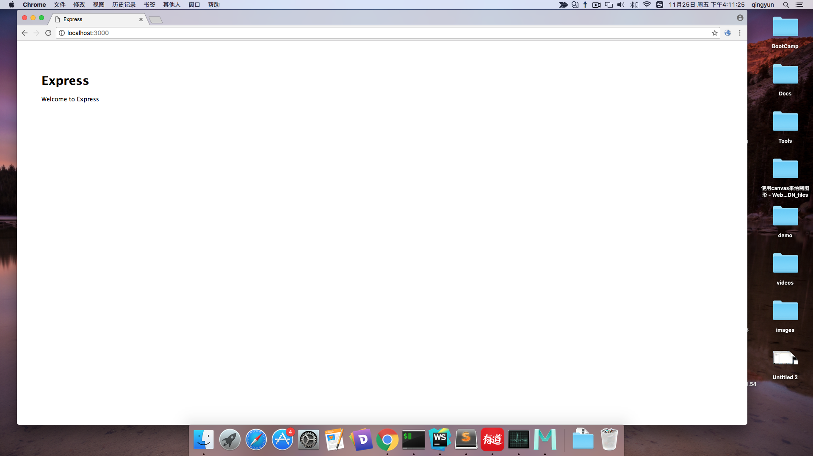

#express使用指南
	第一步：创建项目
    express 项目名称
    第二步：安装依赖
    cd myprj && npm install
    第三步：运行程序
    DEBUG=myprj:* npm start
    
    如果看到:恭喜你成功了。不行的请教同学。
   

#第二步：
##添加自己的代码

	app.js 里面
	服务器接收到的所有包含/users路径的请求，转发给users 路由模块进行处理。
	app.use('/users', users);
	
	user.js 里面
	
	下面代码的意思是：/users/reg 的请求转发到这个路由进行处理。
	router.post('/reg',function(req, res, next){
  
	})
	
#第三步：
	链接数据库：	
	///users/reg的路由配置
	router.post('/reg',function(req, res, next){
	  //链接数据库，链接的是	qingyun 这个数据库
	  var db = require('mongoskin').db('mongodb://localhost:27017/qingyun');
	
		//获取注册信息
	  var user = req.body;
	  //绑定到user,然后对他进行操作。

	  db.bind('users');
	  //_id 是系统默认的主键，可以利用他来防止username重复。
	  //主键是唯一不重复的字段。
	  user._id = user.username;
	  //这个是插入一个user到users表中
	  db.users.insert(user, function(err) {
	  	//如果失败
	    if (err) {
	      res.json({msg:'注册失败'})
	    }else{
	    	//如果成功
	      res.json({msg:'注册成功'})
	    }
	
	  });
	})
	
	

***
#同学们遇到的问题

	 1.对服务器不太理解，总觉得一个路径必须对应一个文件。然后找文件怎么也找不到。
	 这说明对服务器没理解透彻。
	  一种服务器是：服务器一个功能是静态资源服务器。请求的每个路径对应一个服务器的文件路径。
	  一种服务器：每个路径对应服务器一个特定的功能或接口：例如：这个/users/reg 路径对应服务器的一个功能，也就是注册功能。访问这个路径，然后后台会接收你传递的数据，并且注册相应的用户。
	  
	  2。举例 public/html/index.html
	  	浏览器里面应该怎么访问：localhost:3000/html/index.html
	 3.直接在浏览器地址条里面输入一个路径，这种请求是get请求。
	 	router.post('/reg',function(){}) 	
	 	
	 4.什么路由？
	 	路由定义：特定方法，特定路径进行特定处理。
	 	举例：
	 	app.post('/login',function(){
	 		var user = req.body;
	 		console.log('访问到了。。')
	 	})
	 	
	 	当浏览器地址条里面输入 /login 的时候。 上面的路由能起效吗？
	 	如果要触发上一个路由，必须满足，post方法去请求 、/login路径。
	 	
	5.form 不太熟练
		action ="" --请求的路径
		method=""  --请求方法
		<form method="post" action="/login"">
			<input  name="name" value="zs"/>
			<input type="submit" value="提交"/>
		</form>	 	
		
		
	 		
	
	

 